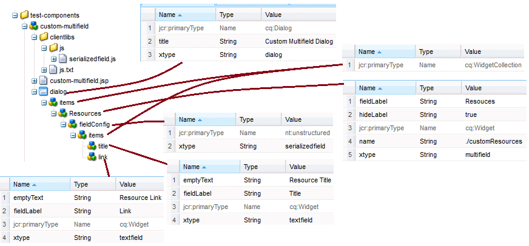

### Structure and Properties

The structure and the corresponding properties of my test multifield component



The custom JS used here is **serializedfield**

Thanks to http://www.repix.ch for the customized JS ([http://www.repix.ch/index.php/download\_file/view/160/201/](http://www.repix.ch/index.php/download_file/view/160/201/))

Please let me know, if you are not able to download the JS script.

### Retrieving the values in JSP

```html
<%@ page import="com.day.cq.wcm.api.WCMMode"%>

<%@include file="/libs/foundation/global.jsp"%><%
%><%@page session="false" %><%
%>

<%
boolean isEdit = WCMMode.fromRequest(request) == WCMMode.EDIT;
boolean isDesign = WCMMode.fromRequest(request) == WCMMode.DESIGN;
%>

<c:set var="isEdit" value="<%= isEdit %>" /><c:set var="isDesign" value="<%= isDesign %>" />

<c:if test="${isEdit || isDesign}">
   <cq:includeClientLib categories="custom.components"/>
</c:if>

<%
String[] resources = properties.get("customResources",String[].class);
%>

<ul>
    <% for(String res: resources ) {
       String[] res_info = res.split("~"); %>
    <li>
        <a href="<%= res_info[1] %>"><span><%= res_info[0] %></span></a>
    </li>
    <% } %>
</ul>
```
