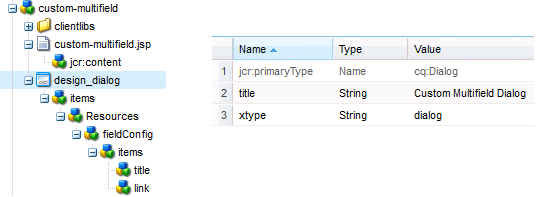

Basically the component properties are stored per page.

We can make it common by 2 ways

### Design Dialog

Instead of creating a dialog, create design_dialog (just a name change, rest all will be same)



##### Retrieving design values in JSP

```java
<%
 String[] resources = currentStyle.get("customResources", String[].class);
%>
```

### Overriding store path in dialog

Here we can use normal dialog panel with store path as follows

**Example:**

Add the below code in the component JSP file

```html
<cq:include path="/content/test/jcr:content/customResources" resourceType="test-components/components/customResources" />
```
