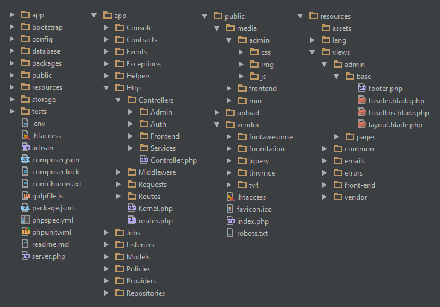

Everyone will have there own way of defining the structure of an application, and whatever I'm going to discuss here is just my way of implementing Laravel for my application.

I love laravel mainly because of its application structure, routes and most importantly the middleware.

Not just Laravel, many of the frameworks out there following the Django way of defining the MVC. Still Django is more powerful om there DB driven Admin console and the caching layers.Leave Django for now, will see what Laravel provides for us.

The basic directory structure is more than enough for small projects, but when it comes to scaling and maintenance, we have to come up with some extended directory structure for the following components.

- Routes
- Controllers
- Models
- Contracts
- Repositories
- Public

I prefer the Laravel directory structure in the following way.

I started loving the [Adonis JS](http://www.adonisjs.com) nodejs framework, mainly because it borrowed the concepts from Laravel.

Hope this post will be useful. Happy coding!!.
