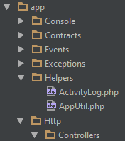

It is always a good practice to have helpers in the application to provide the common utils or anything related to your application in order to avoid redundant codes and better maintenance.

## Helper structure

In my Laravel application, I have included the helpers in the following way.

**Note:** By default there is no Helper directory in the app, we have to create the dir.



## How to use the helper

Create a new util file under Helpers. Best practice is to have the same name for both the file name and class name.

Example I have created a file called **AppUtil.php**, and my AppUtil.php will look like

```php
<?php namespace App\Helpers;

use Log, File, Session;

class AppUtil {

    /**
     * csrf token for form, encrypted for https
     * @return boolean
     */
    public static function getToken() {
        Session::regenerateToken();
        $token = csrf\_token();
        /*if (self::isHttps()) {
            $encrypter = app( 'Illuminate\\Encryption\\Encrypter' );
            $token     = $encrypter->encrypt( $token );
        }*/
        return $token;
    }

}
```

As you see, I have used the name "AppUtil" for both file name and class name.

Next step is to create **alias** for the helpers.

Go to **config/app.php**, and add the following alias under **aliases** in app.php

```php
'AppUtil' => App\Helpers\AppUtil::class,
```

To use the helper in controllers or repositories or in any other file, call as

```php
\AppUtil::getToken()
```

In the same way we can call it in Views also.

Happy coding!!
