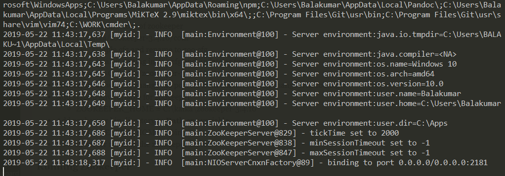
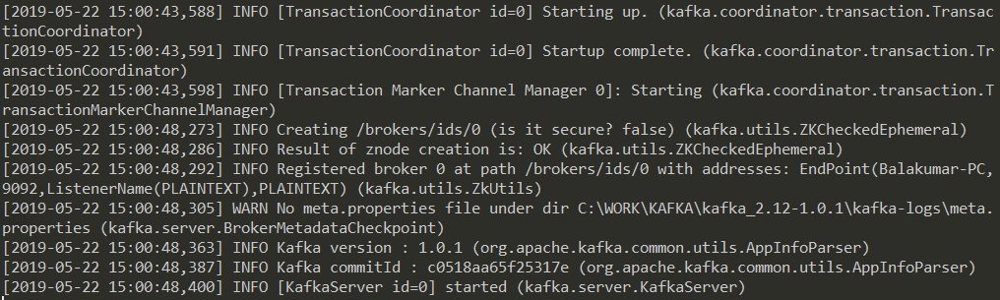
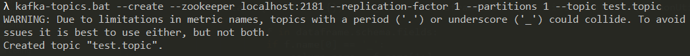
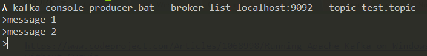
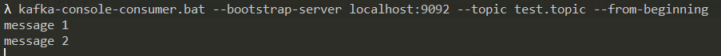

## Softwares and packages to be installed:

Download and install Java if not installed already, and then download other packages related to KAFKA. May be you can create a dir called kafka and keep all the packages and tools.

* **JAVA**
    - Download: [https://www.oracle.com/technetwork/java/javase/downloads/jre8-downloads-2133155.html](https://www.oracle.com/technetwork/java/javase/downloads/jre8-downloads-2133155.html)
    - Make sure to set path and JAVA_HOME
* **KAFKA**
    - [http://kafka.apache.org/](http://kafka.apache.org/)
    - Download: [http://kafka.apache.org/downloads.html](http://kafka.apache.org/downloads.html)
    - Make sure you are downloading the binaries, not the source
* **ZOOKEEPER**
    - [http://zookeeper.apache.org/](http://zookeeper.apache.org/)
    - Download: [https://www.apache.org/dyn/closer.cgi/zookeeper/](https://www.apache.org/dyn/closer.cgi/zookeeper/)

I have downloaded the following files

- [http://www-us.apache.org/dist/zookeeper/stable/zookeeper-3.4.10.tar.gz](http://www-us.apache.org/dist/zookeeper/stable/zookeeper-3.4.10.tar.gz)
- [https://www.apache.org/dyn/closer.cgi?path=/kafka/1.0.1/kafka\_2.12-1.0.1.tgz](https://www.apache.org/dyn/closer.cgi?path=/kafka/1.0.1/kafka_2.12-1.0.1.tgz)

Use WinRAR or any other tool to untar the downloaded zookeeper and kafka tar files.

Now my directory structure will be

- C:/kafka/kafka_2.12-1.0.1
- C:/kafka/zookeeper-3.4.10

## Installing Zookeeper

#### Setting up Zookeeper

- Get in to conf directory of zookeeper
    - C:/kafka/zookeeper-3.4.10/conf
- Find zoo_sample.cfg and rename to zoo.cfg
- Search for dataDir setting in zoo.cfg and update as follows
    - dataDir=C:/kafka/zookeeper-3.4.10/data
- In case, if you want to change the port no from default (2181), change it in zoo.cfg
- Add system env variable for zookeeper
    - ZOOKEEPER_HOME = C:\kafka\zookeeper-3.4.10
- Add zookeeper bin directory to **Path** env variable
    - %ZOOKEEPER_HOME%\bin
- Now all set for running the zookeeper server

#### Running Zookeeper

- Open Command Prompt
- Type **zkserver**, and enter

Don't close and leave the terminal as it is

## Installing Kafka

#### Setting up KAFKA

- Get in to the Kafka config directory
    - C:\kafka\kafka_2.12-1.0.1\config
- Find the file called **server.properties**
- Update log.dirs
    - log.dirs=C:/kafka/kafka_2.12-1.0.1/kafka-logs
- In case if you made any changes in Zookeeper config (host and port), then update the same here as well
- Now all set for running your Kafka

#### Running Kafka

- Get in to the kafka directory
    - C:\kafka\kafka_2.12-1.0.1
- Run the following command
    - **.\bin\windows\kafka-server-start.bat  .\config\server.properties**

## Kafka Topic

#### Creating a topic

cd C:\kafka\kafka_2.12-1.0.1\bin\windows
kafka-topics.bat --create --zookeeper localhost:2181 --replication-factor 1 --partitions 1 --topic test.topic

#### Produce message in a topic

cd C:\kafka\kafka_2.12-1.0.1\bin\windows
kafka-console-producer.bat --broker-list localhost:9092 --topic test.topic

### 

#### Consume messages from a topic

cd C:\kafka\kafka_2.12-1.0.1\bin\windows
kafka-console-consumer.bat --bootstrap-server localhost:9092 --topic test.topic --from-beginning

## 

#### List all topics

cd C:\kafka\kafka_2.12-1.0.1\bin\windows
kafka-topics.bat --list --zookeeper localhost:2181

#### Deleting a topic

cd C:\kafka\kafka_2.12-1.0.1\bin\windows
kafka-topics.bat --delete --zookeeper localhost:2181 --topic test.topic
