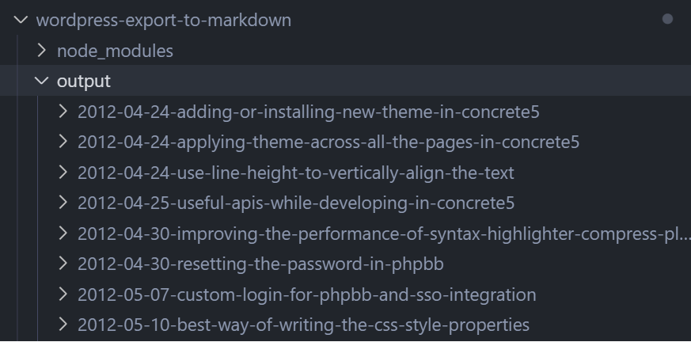
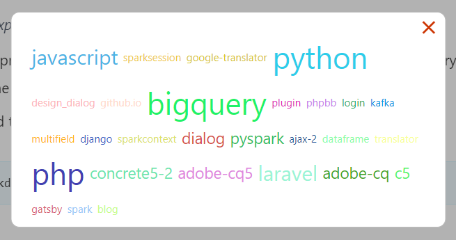
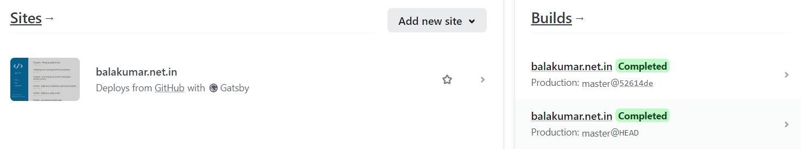
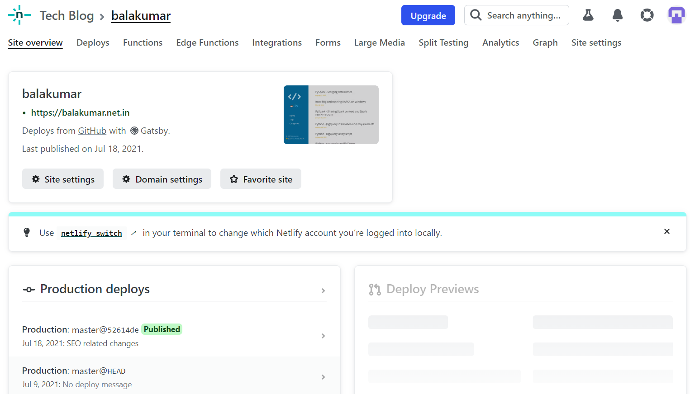
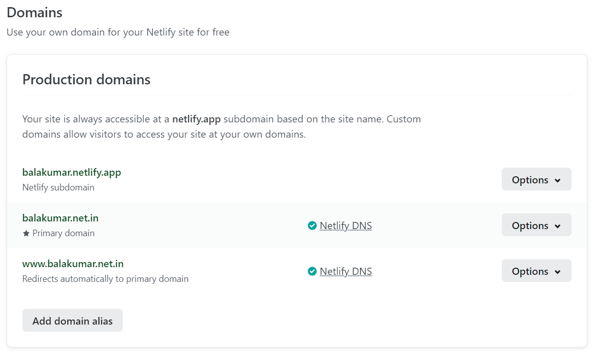
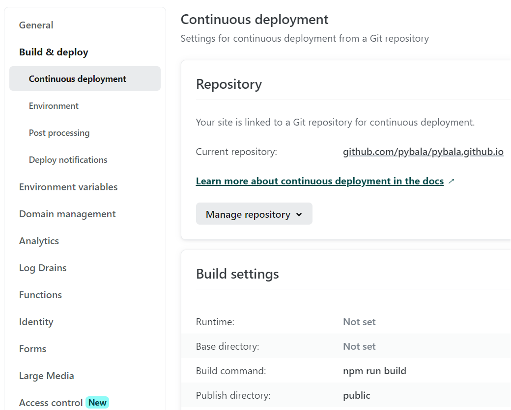

Earlier I hosted my site in many hosting providers, been switching based on the cost at times :). After sometime I decided to reduce the cost and started looking for options, ended up moving to a static model using GitHub pages.

## How did I started

Here is the list of things I need to explore and complete to have my site up and running from GitHub.io

- Export all the contents from wordpress (posts, pages, tags, catagories)
    - have all the media files (images in my case) extracted from content
- Find tools to convert posts to Markdown
- Find Static site generator from Markdown
    - I chose **Gatsby** over **Jekyll**, as I wanted to try javascript based platform.
- Find plugins and/or develop custom plugins to bring in my existing UI components for my theme
- CSS related changes for my theme
- Tool to build, deploy and serve the site

Since I chose Gatsby, I had to explore on below area to become more comfortable before the migration

- Refresh **ReactJS**, bit easier for me as I have done projects using react before.
    - while doing so, I found many new features and states added to React. I hope I'll find time to explore them.
- Some research on **GraphQL**, as Gatsby gets the feed through GraphQL query for all the components.
- Find SEO and other required components.
- Alternatively you can always go with leveraging gatsby-starter-blog without much of learnings.


## Exporting contents from Wordpress

We don't need any external tool or plugin to export the contents, builtin wordpress export plugin is more than enough.

1. Go to Tools and get in to Export section (Tools -> Export)
2. Click "All content" radio button
    - This will export posts, pages, comments..
    - OR you can download them separately by using Posts, Pages, Media radio buttons.
3. As I had lesser posts, I just downloaded only the Posts and manually added and referenced the images in Markdown
4. Click **Download Export File** after the selection, which will give us a zip of XML file.


## Convert Wordpress XML content into Markdown

There are many utilities available in Python and NodeJS to create Markdown files from Wordpress XML.
I have used below NodeJS package to convert them, it has got all the options to convert according to our requirements.
[https://github.com/lonekorean/wordpress-export-to-markdown](https://github.com/lonekorean/wordpress-export-to-markdown)

### How to convert

- Clone the package **wordpress-export-to-markdown**
    > cd wordpress-export-to-markdown
- Copy downloaded Wordpress content XML (**export.xml**) file to the root of the above directory
    - you can also pass the file as argument (**--input**)
- Run the below command to create blog content structure

```shell
npx wordpress-export-to-markdown --post-folders=true --prefix-date=true
```

--post-folders: To create folder with blog title and place .md file and images under the folder.

--prefix-date: To add date as prefix along with the title

If the above command is successful, then you would see a folder called **output** in the root of the directory. You can also point to a different folder using **--output** option.

The output will be something like below



## Installing and customizing Gatsby to build a site or blog

Now we got the markdown (.md) for all the blogs, and its time to play with Gatsby js.

### Install Gatsby and blog starter package

Gatsby has cli utilties which is very useful to create new sites and run required commands. I have installed the cli package globally as follows.

```shell
npm install -g gatsby-cli
```

Gatsby CLI - official documentation
> [https://www.gatsbyjs.com/docs/reference/gatsby-cli/](https://www.gatsbyjs.com/docs/reference/gatsby-cli/)

All the basic functionalities of a blog can be obtained from the below starter package, we dont need to develop anything on our own.

> [https://www.gatsbyjs.com/starters/gatsbyjs/gatsby-starter-blog](https://www.gatsbyjs.com/starters/gatsbyjs/gatsby-starter-blog)

```shell
gatsby new my-new-blog https://github.com/gatsbyjs/gatsby-starter-blog
```

### Local development

Run the following command from the root of site dir

```shell
gatsby develop
or
npm run develop
or
npm start
```

This will start the blog in port 8000 by default, you can point to different port by passing **-p** parameter.
The blog and the graphql data can be viewed from

> http://localhost:8000/
> <br/>http://localhost:8000/___graphql


### Core site builder APIs and components

Gatsby provides plugins and many APIs to build your site, from designing the layout to making it available for search engines.

Below 3 API components are the important and foundational blocks of Gatsby. You can define them in either JavaScript or TypeScript.

- **gatsby-config.js**
    > Defines Site/Blog metadata and plugins.
    > <br/> [https://www.gatsbyjs.com/docs/reference/config-files/gatsby-config/](https://www.gatsbyjs.com/docs/reference/config-files/gatsby-config/)
- **gatsby-node.js**
    > Contains methods to create and process site pages and components, GraphQL to serve data for all the components.
    > <br/> [https://www.gatsbyjs.com/docs/reference/config-files/gatsby-node/](https://www.gatsbyjs.com/docs/reference/config-files/gatsby-node/)
- **gatsby-browser.js**
    > The Gatsby Browser API gives you many options for interacting with the client-side of Gatsby. You can import client specific css, fonts, scripts.. etc.
    > <br/> [https://www.gatsbyjs.com/docs/reference/config-files/gatsby-browser/](https://www.gatsbyjs.com/docs/reference/config-files/gatsby-browser/)

All the above files should present in the root of your site directory.

You can take a look at my blog component structure. [https://github.com/pybala/pybala.github.io](https://github.com/pybala/pybala.github.io)

### Example: Adding custom component

The default Gatsby components with bit of style changes are more than enough to produce a blog site. In case, if you want to add any new component, then follow React component model.

In my blog, I have shown the tags and categories as word cloud.



<!-- Your github site is now  -->

### Create and manage Github repo for your Blog

- Login to your Github account, and create new repository.
- The repository name should be 
    > &lt;username&gt;.github.io
- In my case, the repository name is **pybala.github.io**.
- Once the repository is created, you need to enable pages and configure deployment branch and other required settings.

With the above changes your github.io site will be ready with the content from **.md** file from root (default is RAEDME.md).

Explore https://docs.github.com/en/pages/quickstart for more details.

As I wanted to build and deploy my site from Netlify with custom domain, I can put my blog content in any of the repo and just need to point the right repo in Netlify.

Ofcourse, you also have option to configure custom domain within github itself. https://docs.github.com/en/pages/configuring-a-custom-domain-for-your-github-pages-site


## Netlify: Build and deployment

Use your github account to signup and login to Netlify (https://app.netlify.com/). To configure new site delpoyment, you need to create a team account in Netlify. For Open Source Account, you need to fill in your application details and submit to Netlify (https://opensource-form.netlify.com/). Once your account is active, you should be able to setup further for all the needed settings in Netlify.

By default, you get your free domain from netlify for the sitename created with the account. (ie) https://&lt;site name&gt;.netlify.app
Once initial setup done, you will get to see the list of sites in your Netlify app home page.

Here is how my Netlify home page is shown with the list of sites configured


Click the site to add/update Site and Domain settings.

#### My Netlify Site Overview page



#### My Netlify Domain Settings page



#### My Netlify Build and Deployment settings




## References

&nbsp;&nbsp; https://www.gatsbyjs.com/docs
<br/> &nbsp;&nbsp; https://react.dev/
<br/> &nbsp;&nbsp; https://docs.netlify.com/
<br/> &nbsp;&nbsp; https://github.com/lonekorean/wordpress-export-to-markdown
<br/> &nbsp;&nbsp; https://www.gatsbyjs.com/docs/reference/gatsby-cli/
<br/> &nbsp;&nbsp; https://www.gatsbyjs.com/starters/gatsbyjs/gatsby-starter-blog

<br/>