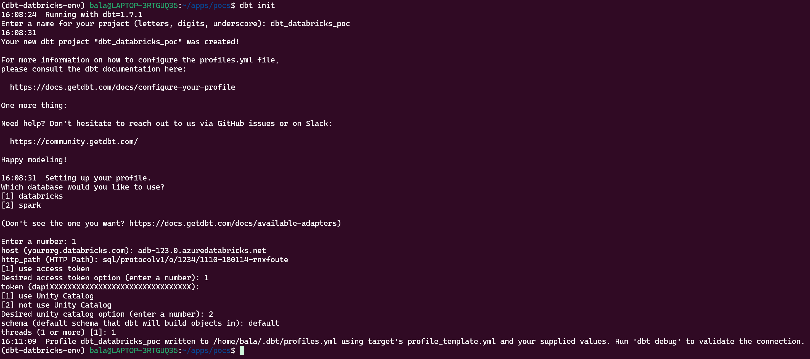
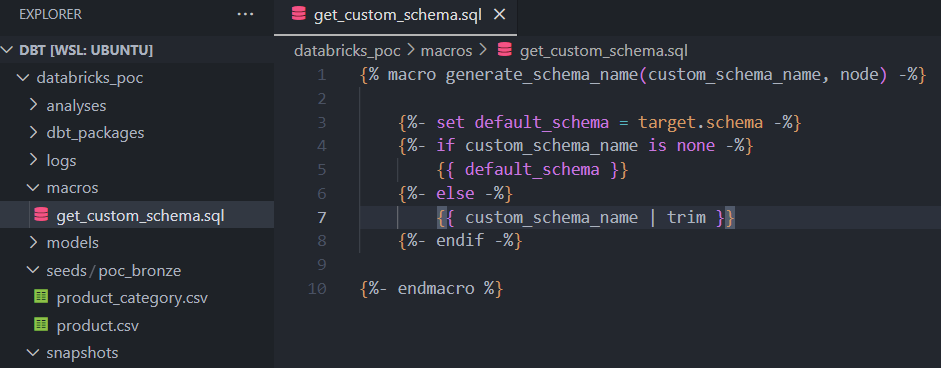
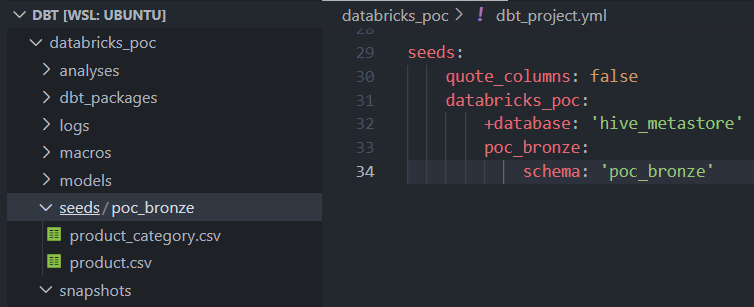
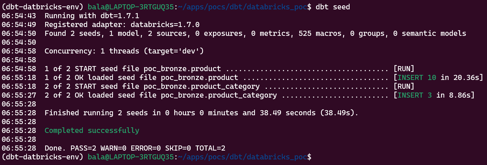
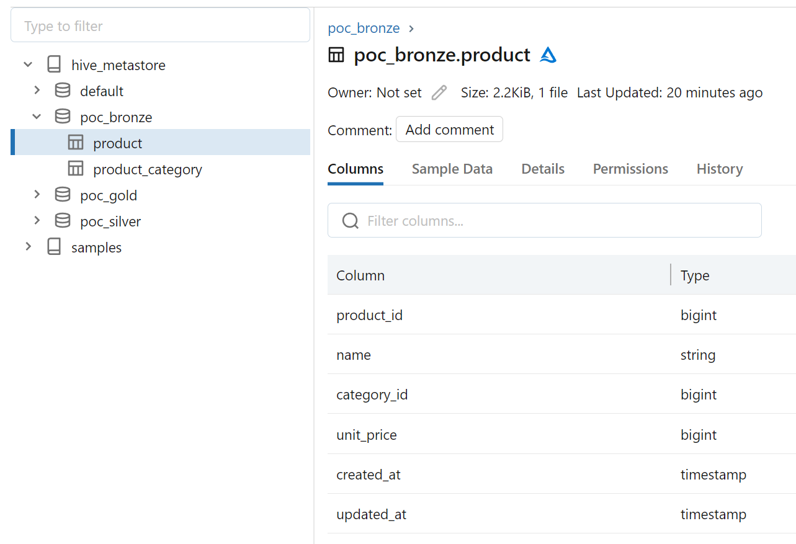
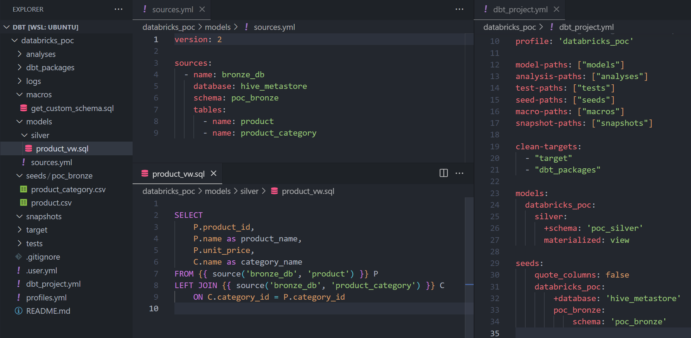
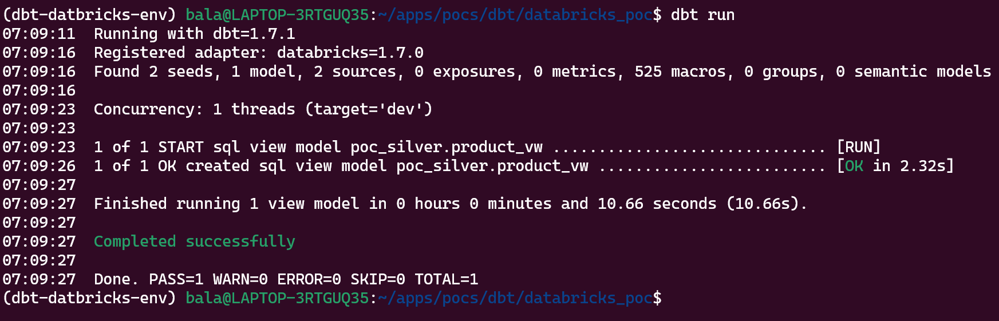
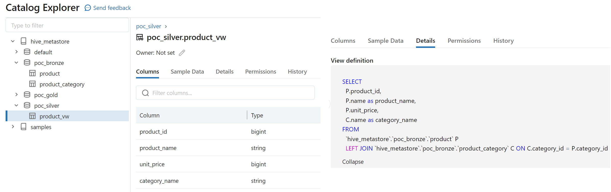
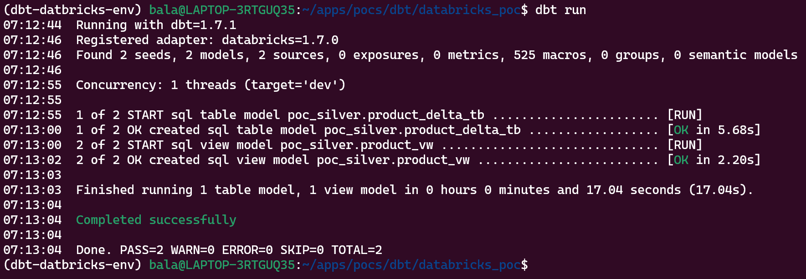
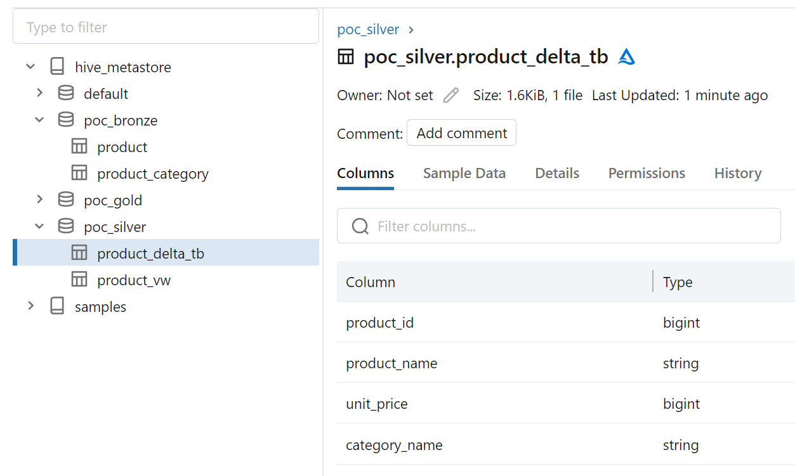

DBT (Data Build Tool) is a command line data transformation tool, which enables data analysts and engineers to transform data in their warehouses more effectively. 
It allows you to test business logic, ensuring data quality, and fix issues proactively before they impact your business. 

Here I'm using the Databricks service from Azure, and the DBT commands are ran from local (can be part of Databricks Workflow or any other orchestrator)

### Prerequisites

- Python (> 3.6)
- Databricks cloud
- dbt-databricks (pip library)

The versions I used for this POC are
- Python - 3.10.12
- Azure Databricks - 13.3 LTS
- dbt-databricks - 3.0.0

The current latest version of dbt-databricks (v3.0.0) needs min Python version as 3.8, as its dependant library **databricks-sql-connector** requires the mentioned version.

### Installation and initial setup

#### Install "dbt-databricks" python library

```shell
pip install dbt-databricks
```

#### Setup DBT

Get in to the directory where you want to create new DBT project and run the following command.

> Note: dbt init will create a new project dir with the name you mention in the interactive console. 

```shell
dbt init
```

The above command will provide multiple options to choose and enter in interactive manner. Below picture depicts sample project setup.



The above setup does not have proper Databricks details entered, I just created for reference. Once you understand the DBT structure, you should be able to create the project manually without **dbt init** command.

After completing the above setup, you would see the dir struture as follows.

```shell
├── README.md
├── analyses
├── dbt_project.yml
├── macros
├── models
│   └── example
│       ├── my_first_dbt_model.sql
│       ├── my_second_dbt_model.sql
│       └── schema.yml
├── seeds
├── snapshots
└── tests
```

The conection details are stored in profiles.yml file, which is by default created under user home directory **~/.dbt/**.

DBT will search for profiles.yml in the following order.

1. Under current project dir
2. DBT_PROFILES_DIR (if DBT_PROFILES_DIR is set to maintain custom dir)
3. User home dir (~/.dbt)

> **Note:** No need of profiles.yml for **dbt Cloud**

### Project structure and config files

```shell
 databricks_poc
	├── analyses
	├── macros
	├── models
	├── seeds
	├── snapshots
	├── tests
	├── README.md
    ├── dbt_project.yml
    └── profiles.yml
```

#### profiles.yml

```yml
databricks_poc:
  target: dev
  outputs:
    dev:
      type: databricks
      catalog: hive_metastore
      schema: default
      host: 
      http_path:
      token:
```

#### dbt_project.yml

```shell
name: 'databricks_poc'
version: '1.0.0'
config-version: 2

profile: 'databricks_poc'

model-paths: ["models"]
analysis-paths: ["analyses"]
test-paths: ["tests"]
seed-paths: ["seeds"]
macro-paths: ["macros"]
snapshot-paths: ["snapshots"]

clean-targets:
  - "target"
  - "dbt_packages"
```

### How DBT seed works

I have created following schemas (databases) in Databricks

```sql
CREATE SCHEMA IF NOT EXISTS poc_bronze;
CREATE SCHEMA IF NOT EXISTS poc_silver;
CREATE SCHEMA IF NOT EXISTS poc_gold;
```

#### Changing default Schema (database)

By default, DBT generates the target schema which is the combination of target_schema (default schema defined in the profile) and custom_schema.
Based on the config we defined for seeds, our expectation would be to create and load the data under the defined schema (ie poc_bronze).

> **Note:** instead of hive_metastore.**poc_bronze**, DBT will create new schema (database) like this => hive_metastore.**defaut_poc_bronze**

DBT gets the schema from built-in macro called **generate_schema_name**, which has following line to return schema

```sql


    
    
        {{ default_schema }}
    
        {{ default_schema }}_{{ custom_schema_name | trim }}
    


```

So, we need to update the following line to satisfy our requirement

```sql
{{ default_schema }}_{{ custom_schema_name | trim }}
TO
{{ custom_schema_name | trim }}
```

To do so, we need to add a new macro file called "get_custom_schema.sql" with the updated code as like follows.



#### Load data using **dbt seed**

> **Note:** seed is mainly for mapping and other static dataset of smaller in size, not recommended for large volume of data. People generally avoid running seed in Production, so use it for testing and smaller mapping dataset.

We have the following CSV files with the sample data for **product** and **product_category** tables that are supposed to be created under **poc_bronze** database.

###### product.csv [ seeds / poc_bronze / product.csv ]

```txt
product_id, name, category_id, unit_price, created_at, updated_at
1, Apples, 1, 100, 2023-11-17 10:00:00, 2023-11-17 10:00:00
2, Oranges, 1, 80, 2023-11-17 10:00:00, 2023-11-17 10:00:00
3, Grapes, 1, 70, 2023-11-17 10:00:00, 2023-11-17 10:00:00
4, Onions, 2, 90, 2023-11-17 10:00:00, 2023-11-17 10:00:00
5, Tomatoes, 2, 60, 2023-11-17 10:00:00, 2023-11-17 10:00:00
6, Potatoes, 2, 50, 2023-11-17 10:00:00, 2023-11-17 10:00:00
7, Carrots, 2, 100, 2023-11-17 10:00:00, 2023-11-17 10:00:00
8, Milk, 3, 30, 2023-11-17 10:00:00, 2023-11-17 10:00:00
9, Butter, 3, 120, 2023-11-17 10:00:00, 2023-11-17 10:00:00
10, Cheese, 3, 150, 2023-11-17 10:00:00, 2023-11-17 10:00:00
```

###### product_category.csv [ seeds / poc_bronze / product_category.csv ]

```txt
category_id, name
1, Fruits
2, Vegetables
3, Dairy
```

This is how the files and the seeds configured for this prject.



Now run the following command to create respective tables and load data into them.

```shell
dbt seed
```




> **Note:** No need to create tables and schema manually before seeding, DBT will create the tables with schema inferred from CSV files.
> <br/> But, DBT has options to define our custom schema fully or partially for any columns.

##### Azure Databricks catalog




### How DBT model works

Data modeling with dbt is a way of transforming data for business intelligence or downstream applications in a modular approach.
 - We can write models using SQL and Python.
 - A SQL model is nothing but a SELECT statement.
 - SQL models are defined in **.sql** files under **models** dir
 - dbt models are materialized as VIEWs by default

> **Note:** Python support is added from dbt Core v1.3

In this project I will be referring SQL models only. Below picture shows how the models are defined and configured for this project.

- some ***.sql** files under models dir 
- models related config in dbt_project.yml 
  - to configure different database and other properties
- models/sources.yml 
  - to refer existing tables



##### models config in dbt_project.yml

```shell
models:
  databricks_poc:
    silver:
      +schema: 'poc_silver'
      materialized: view
```

- **+** sign is like global config, which applies to the entire hiearchy from current level.
- **+schema** tells DBT to create the models under **poc_silver** database for all models under **models/silver** dir and subdirs
- **schema** without **+** sign means only for the mentioned dir (ie models/silver dir)
- We can also override the materialization type within model sql file by mentioning the type on top
  - > {{ config(materialized = "table") }}
- SQL Model supports multiple types of materialization <a href="https://docs.getdbt.com/docs/build/materializations" target="_blank">https://docs.getdbt.com/docs/build/materializations</a>
  - View
  - Table
  - Incremental
  - Ephemeral
  - Materialized View
- Python model supports only two materializations for now
  - table
  - incremental

In this project, we will be covering SQL model VIEW and TABLE materializations.
As per our config, if we run **dbt run** command we should see the expected view created under **poc_silver** database.

```shell
dbt run
```



##### Azure Databricks catalog



#### Creating a Delta table using model


Again run **dbt run** command to create the required delta table.






Yo can find the source code in my repo https://github.com/pybala/dbt_databricks_poc.

I will be covering basic data quality testing and incremental models in next set of articles.