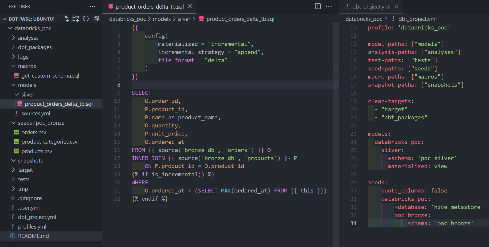
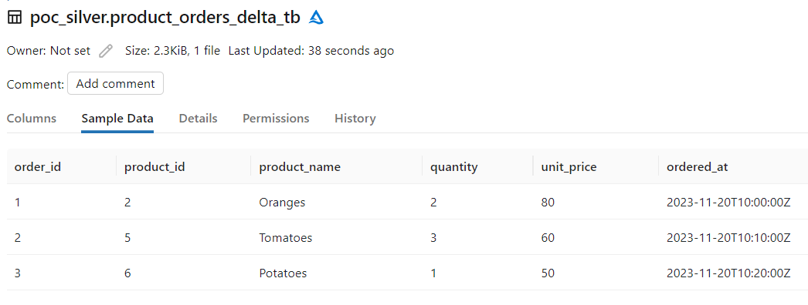
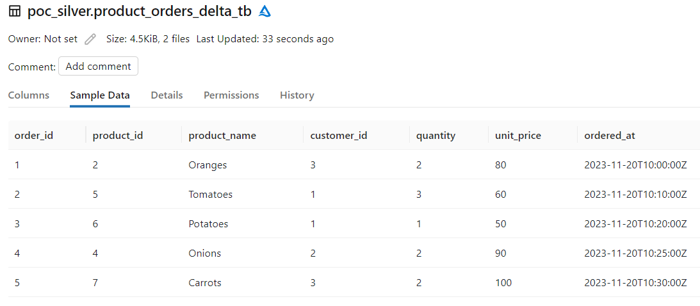
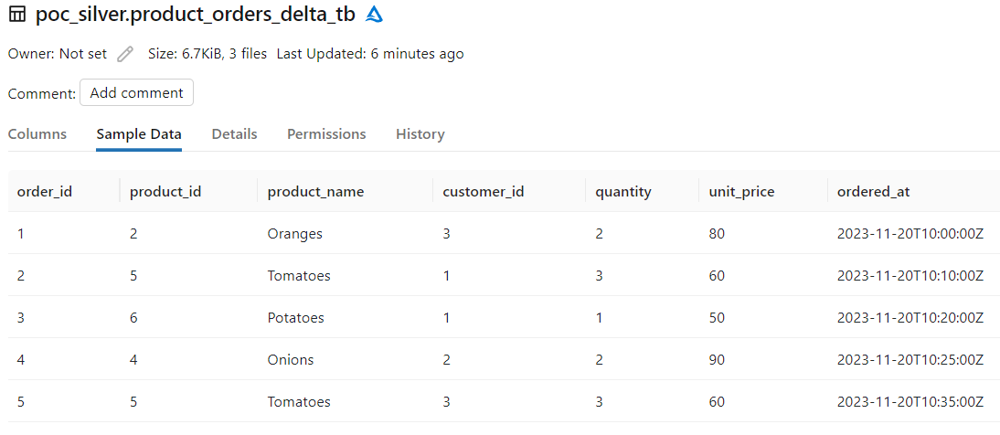

Yo can refer this page (https://balakumar.net.in/databricks-and-dbt-part-1/) for basic usage of DBT for Databricks.


## Types of incremental strategies supported in models

- append
- merge
- delete+insert
- insert_overwrite

The default and other strategy types support varies depends on the adapter used.
Strategies for some of the adapters are given below, refer DBT documentation for more details.

| Adapter        | Default strategy | Other strategies                     |
|----------------|------------------|--------------------------------------|
| dbt-spark      | append           | merge (Delta, Iceberg and Hudi), insert_overwrite |
| dbt-databricks | append           | merge (Delta, Iceberg and Hudi), insert_overwrite |
| dbt-snowflake  | merge            | append, delete+insert                |
| dbt-bigquery   | merge            | insert_overwrite                     |
| dbt-redshift   | append           | merge, delete+insert                 |
| dbt-postgres   | append           | merge, delete+insert                 |

## Configuring the incremental strategy

Incremental strategy can be defined either in model or dbt_project.yml file.

##### model file

```sql
{{
  config(
    materialized='incremental',
    unique_key='product_id',
    incremental_strategy='merge',
    ...
  )
}}

select ...
```

##### dbt_project.yml

```yml
models:
  +incremental_strategy: "insert_overwrite"
```

The above configuration will apply **insert_overwrite** strategy for all the incremental models under the project.

### Sample datasets

We are going to use the following datasets to explore the **append** and **merge** incremental strategies.

##### products

```txt
|product_id|name     |category_id|unit_price|created_at          |updated_at          |
|----------|---------|-----------|----------|--------------------|--------------------|
|1         | Apples  | 1         | 100      | 2023-11-17 10:00:00| 2023-11-17 10:00:00|
|2         | Oranges | 1         | 80       | 2023-11-17 10:00:00| 2023-11-17 10:00:00|
|3         | Grapes  | 1         | 70       | 2023-11-17 10:00:00| 2023-11-17 10:00:00|
|4         | Onions  | 2         | 90       | 2023-11-17 10:00:00| 2023-11-17 10:00:00|
|5         | Tomatoes| 2         | 60       | 2023-11-17 10:00:00| 2023-11-17 10:00:00|
|6         | Potatoes| 2         | 50       | 2023-11-17 10:00:00| 2023-11-17 10:00:00|
|7         | Carrots | 2         | 100      | 2023-11-17 10:00:00| 2023-11-17 10:00:00|
```

##### orders

```txt
|order_id|product_id|customer_id|quantity|ordered_at          |
|--------|----------|-----------|--------|--------------------|
|1       | 2        | 3         | 2      | 2023-11-20 10:00:00|
|2       | 5        | 1         | 3      | 2023-11-20 10:10:00|
|3       | 6        | 1         | 1      | 2023-11-20 10:20:00|
```

With the above datasets, we will create and update a delta table under silver model. (/models/silver/product_orders_delta_tb.sql)

## Append incremental strategy

##### models / silver / product_orders_delta_tb.sql

I have the following incremental model defined with append strategy (optional, default for dbt-spark and dbt-databricks).

```sql
{{ 
    config(
        materialized = "incremental",
        incremental_strategy = "append",
        file_format = "delta"    
    )
}}

SELECT 
    O.order_id,
    P.product_id,
    P.name as product_name,
    O.quantity,
    P.unit_price,
    O.ordered_at
FROM {{ source('bronze_db', 'orders') }} O
INNER JOIN {{ source('bronze_db', 'products') }} P
    ON P.product_id = O.product_id

WHERE 
    O.ordered_at > (SELECT MAX(ordered_at) FROM {{ this }})

```

Some details about incremental model sql file

- **delta file** format used.
- incremental strategey is defiend as **append** (Optional, as dbt-spark and databricks default is append only).
- Not defined any **Unique Key** (as we are just appending new rows).
- Using **ordered_at** from orders table as **watermark** column to get the new rows.
- **this** refers to the **current model** (product_orders_delta_tb table).

We have options to configure more attributes depends on the adapter and the file formats used, some of them are

- partition_by
- cluster_by
- on_schema_change
- merge_update_columns
- location_root (for custom storage, delta table..)
- liquid_clustered_by (for Delta tables)
- pre_hook
- post_hook



Now run the models by invoking the *dbt run* command as follows.

```shell
dbt run
```

We can also run models selectively based on different attributes (model name, model path, tags.. etc), refer the following offical documentation for more details.
https://docs.getdbt.com/reference/node-selection/syntax#examples

##### product_orders_delta_tb delta table after the first run



Now, lets add 2 more rows to **orders** table.

```txt
|order_id|product_id|customer_id|quantity|ordered_at          |
|--------|----------|-----------|--------|--------------------|
|4       | 4        | 2         | 2      | 2023-11-20 10:25:00|
|5       | 7        | 3         | 2      | 2023-11-20 10:30:00|
```

Run the seed for orders table, and then run the incremental model.

```shell
dbt seed --select orders
dbt run
```

##### product_orders_delta_tb delta table after the second run




## Merge incremental strategy

I have updated the model config to use **merge** as the incremental_strategy. For merge, we need to provide unique_key details for performing the merge process.
Here **order_id** is used as unique_key.

It is also possible to define multiple columns as unique_key by using array or composite expression.
- unique_key = ['order_id', 'customer_id']
- unique_key = "order_id||'-'||customer_id" (better to create composite id as select)

For example:

```sql
{{ 
    config(
        materialized = "incremental",
        unique_key = ['order_id'],
        incremental_strategy = "merge",
        file_format = "delta"
    ) 
}}

SELECT 
    O.order_id || '-' || O.customer_id as order_id
```

Now, lets seed new data into orders table to test the merge functionality.

```txt
|order_id|product_id|customer_id|quantity|ordered_at          |
|--------|----------|-----------|--------|--------------------|
|5       | 5        | 3         | 3      | 2023-11-20 10:35:00|
```

We have updated one of the existing order_id (5) with other product and quantity data.
Also I have updated the incremental model with merge strategy, with order_id as unique_key.

```sql
{{ 
    config(
        materialized = "incremental",
        unique_key = ['order_id'],
        incremental_strategy = "merge",
        file_format = "delta"
    ) 
}}

SELECT 
    O.order_id,
    P.product_id,
    P.name as product_name,
    O.customer_id,
    O.quantity,
    P.unit_price,
    O.ordered_at
FROM {{ source('bronze_db', 'orders') }} O
INNER JOIN {{ source('bronze_db', 'products') }} P
    ON P.product_id = O.product_id

WHERE 
    O.ordered_at > (SELECT MAX(ordered_at) FROM {{ this }})

```

The delta table in databricks, after running the above model.




#### Using post_hook to optimize Delta tables

Both **pre_hook** and **post_hook** are very useful for performing **validations, optimizations and other performance and dependencies** related functionalities.

For example, running OPTIMIZE for above model (delta table)

```sql
{{ 
    config(
        materialized = "incremental",
        unique_key = ['order_id'],
        incremental_strategy = "merge",
        file_format = "delta",
        post_hook=[
            "OPTIMIZE {{ this }}",
            "ANALYZE TABLE {{ this }} COMPUTE STATISTICS FOR ALL COLUMNS"
        ]
    ) 
}}
```

