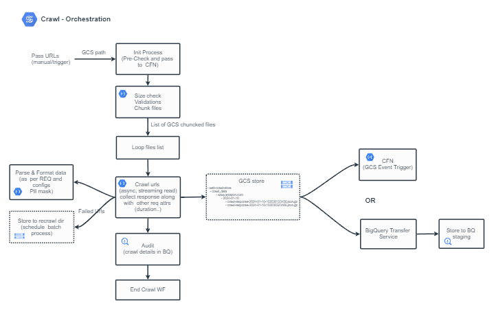

A simple web scraping solution using Google cloud Workflow and BigQuery, without Cloud function.

Orchestration steps
- accept list of urls as input
- Apply simple validation and form a hash map for domains and urls
- Loop thru dict and make HTTP calls
- Format the response
- store them to BigQuery RAW table as streaming insert

Scalable approach would be ideally using cloud functions for handling some of the processing layers such as validations, chucking, crawling.. etc.

## Limitations with Workflow (on HTTP connector)

- 2MB — Response size: The maximum size of an HTTP response (if saved to a variable, the memory limit for variables applies)
- 512 KB — Memory limit for variables: variables: The maximum amount of memory that you can use for all variables that you define in a single execution of a given workflow.
- with HTTP connector in Workflows, it is only possible to invoke external endpoints, not the internal ones that are attached to a VPC.

So, if you try to concatenate multiple responses, then you will encounter memory limit error.
Here in this excercise, I have couple of varaibles for storing the responses (max 5 urls of repsonse size in lesser size).

You can use this workflow as a reference model for handling REST json responses of lesser size (may be upto 20 responses).

## Workflow source

```yaml
main:
    params: [args]
    steps:
    - initialize:
        assign:
            - app_name: "seo-analysis-crawl"
            - project_id: ${sys.get_env("GOOGLE_CLOUD_PROJECT_ID")}
            - dataset: "seo_analysis_ds"
            - raw_bq_table: "crawled_data_raw_tb"
            - gcs_bucket: "web-crawl-store"
            - gcs_root_dir: "crawl_data"
            - web_urls_list: ${args.web_urls}
            - batch_max_size: 10
            - bq_ingest_list: []
            - urls_errored: []
            - current_date: ${text.substring(time.format(sys.now()), 0, 10)}
    - createUrlsDict:
        call: createUrlsDict_swf
        args:
            web_urls: ${web_urls_list}
        result: urlsDictData
    - read_web_pages:
        for:
            value: domain
            in: ${urlsDictData.domains_list}
            steps:
                - getDomainUrls:
                    for:
                        value: web_url
                        in: ${urlsDictData.urls_map[domain]}
                        steps:
                            - makeGetCall:
                                call: readWebPage_swf
                                args:
                                    web_url: ${web_url}
                                result: webCrawlResp
                            - formatResponse:
                                call: formatWebResponse_swf
                                args:
                                    domain: ${domain}
                                    web_url: ${web_url}
                                    web_response: ${webCrawlResp["response"]}
                                    current_date: ${web_url}
                                result: formattedData
                            - updateResponse:
                                assign:
                                    - insert_json: {}
                                    - insert_json["insertId"]: ${uuid.generate()}
                                    - insert_json["json"]: ${formattedData}
                                    - bq_ingest_list: ${list.concat(bq_ingest_list, insert_json)}
    - insertToBQRawTable:
        call: streamingInsertToBQ_swf
        args:
            project: ${project_id}
            dataset: ${dataset}
            table: ${raw_bq_table}
            rows: ${bq_ingest_list}
        result: bqInsertResp
    - final_step:
        return: ${bqInsertResp}


createUrlsDict_swf:
    params: [web_urls]
    steps:
        - assignStep:
            assign:
                - domains_list: []
                - urlMap: {}
                - returnDict: {}
        - makeJsonL:
            for:
                value: url
                in: ${web_urls}
                steps:
                    - basicCheck:
                        switch:
                            - condition: ${text.match_regex(url, "^http") == false}
                              steps:
                                - urlFormat:
                                    assign:
                                        - url: ${"https://" + url}
                    - updateVars:
                        assign:
                            - url_split: ${text.split(url, "/")}
                            - domain: ${url_split[2]}
                    - urlDictInit:
                        switch:
                            - condition: ${not(domain in urlMap)}
                              steps:
                                - addDomainMap:
                                    assign:
                                        - urlMap[domain]: []
                                        - domains_list: ${list.concat(domains_list, domain)}

                    - updateUrlsMap:
                        assign:
                            - urlMap[domain]: ${list.concat(urlMap[domain], url)}
        - updateReturnDict:
            assign:
                - returnDict["domains_list"]: ${domains_list}
                - returnDict["urls_map"]: ${urlMap}
        - returnResult:
            return: ${returnDict}


readWebPage_swf:
    params: [web_url]
    steps:
        - assignStep:
            assign:
                - return_dict: {}
        - makeApiCall:
            try:
                call: http.get
                args:
                    url: ${web_url}
                result: apiResponse
            except:
                as: e
                steps:
                    - setFailedState:
                        assign:
                            - return_dict: {"status":"failed", "response":"Error making api call"}
        - setSuccessState:
            assign:
                - return_dict: {"status":"success", "response": "${apiResponse}"}
        - returnResult:
            return: ${return_dict}


formatWebResponse_swf:
    params: [domain, web_url, web_response, current_date]
    steps:
        - format_data:
            assign:
                - formatted_resp: {}
                - formatted_resp["domain"]: "${domain}"
                - formatted_resp["url"]: "${web_url}"
                - formatted_resp["response_code"]: "${web_response.code}"
                - formatted_resp["content_length"]: '${web_response.headers["Content-Length"]}'
                - formatted_resp["is_html"]: true
                - formatted_resp["response_body"]: "${web_response.body}"
                - formatted_resp["response_header"]: "${json.encode_to_string(web_response.headers)}"
                - formatted_resp["crawled_ts"]: "${sys.now()}"
        - content_type_check:
            switch:
                - condition: ${text.match_regex(web_response.headers["Content-Type"], "text/html") == false}
                  steps:
                    - update_is_html:
                        assign:
                            - formatted_resp["is_html"]: false
        - returnResult:
            return: ${formatted_resp}


streamingInsertToBQ_swf:
    params: [project, dataset, table, rows]
    steps:
        - assignStep:
            assign:
                - domains_list: []
        - insertAll:
            call: googleapis.bigquery.v2.tabledata.insertAll
            args:
                projectId: ${project}
                datasetId: ${dataset}
                tableId: ${table}
                body:
                    rows: ${rows}
            result: insertAllResult
        - returnResult:
            return: ${insertAllResult}
```

### Parsing HTML using BigQuery and Cheerio

To parse the HTML content, I'm using a javascript library called **cheerio** (https://github.com/cheeriojs/cheerio).
We should package cheerio for bigquery, as we dont have an option to import third party packages directly.

We need npm and webpack to bundle cheerio and its dependencies, which I will cover in separate blog.
I have uploaded the package in GCS to invoke in bigquery function.

```sql
CREATE OR REPLACE FUNCTION `poc-project-1.seo_analysis_ds.parse_html_fn`(html_str STRING)
RETURNS STRING
LANGUAGE js
OPTIONS (library = 'gs://web-crawl-store/bigquery-js-libs/cheerio.js')
AS r"""

let test_html = "\n\n\n\n\n\n<!DOCTYPE html>\n<html\n  lang=\"en\"\n  \n  \n  
data-a11y-animated-images=\"system\" data-a11y-link-underlines=\"true\"\n  >\n\n\n\n\n  
<head>\n<meta charset=\"utf-8\"><title>GitHub: Let’s build from here · GitHub</title>
<meta name=\"description\" content=\"GitHub is where over 100 million developers shape the future of software, together.\"></head>
\n\n  <body><div id=\"js-global-screen-reader-notice-assertive\" class=\"sr-only\" aria-live=\"assertive\" aria-atomic=\"true\">
test content</div>\n  </body>\n</html>"

let meta_info = {}
const html_obj = cheerio.load(html_str);

let title = html_obj('title').text();
let meta_desc = $('meta[name="description"]').attr('content');
let meta_viewport = $('meta[name="viewport"]').attr('content');
let canonical_url = $('link[rel="canonical"]').attr('href');

// Parse other tags and content and collect required attributes

return meta_info
""";

SELECT `poc-project-1.seo_analysis_ds.parse_html_fn`("<html><title>fasafa</title></html>") AS tags;
```

We should be able to parse the required attributes and meta by using the above function.

## Scalable approach using Workflow with Cloud function

The following approach may provide a scalable solution to this requirement. We can also include **Cloud Tasks** to offload some of the processes.


